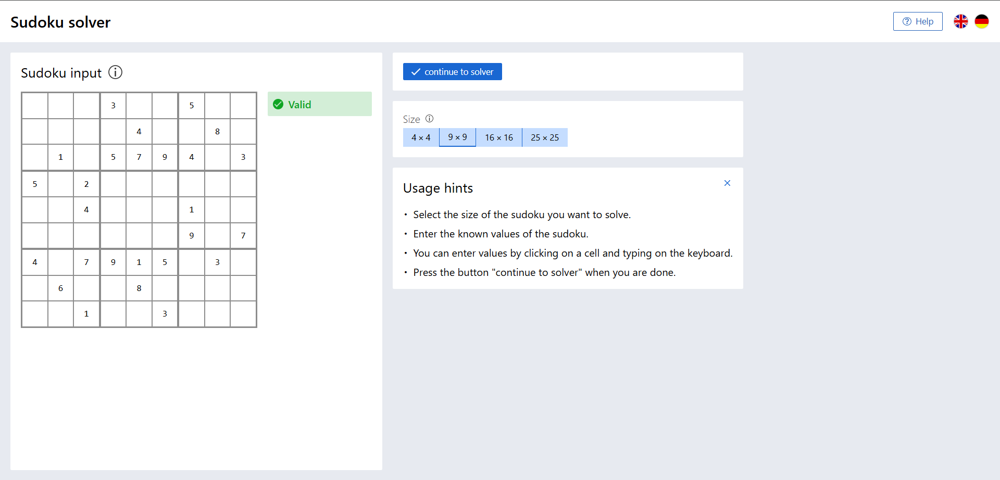
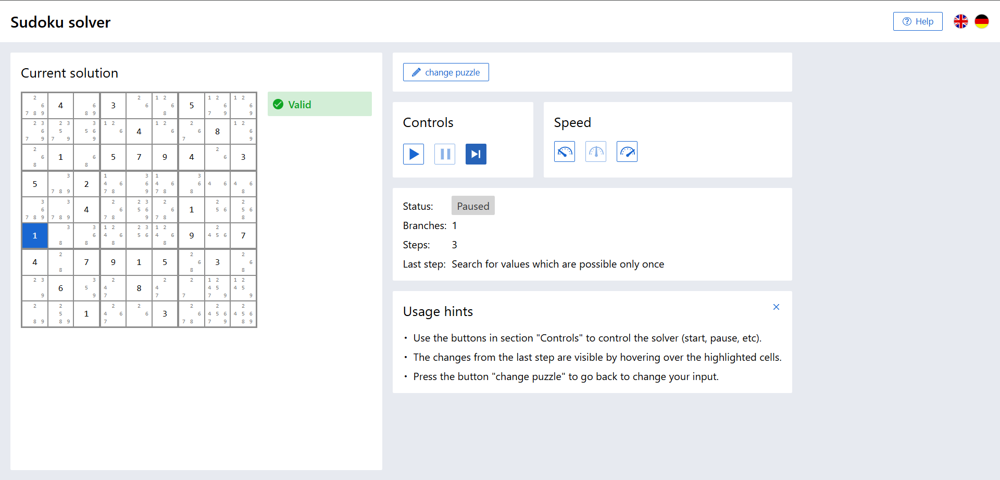

# Sudoku Solver (in Angular)

## About

The solver allows to enter a Sudoku which is not solved yet.


It then solves it step by step. Every step updates the UI and gives a note what was done in the last step.


My motivation behind developing this was to answer the question "When I solve a Sudoku, my brain follows certain algorithms to find a solution. Can I write them down as source code? Also I want a nice UI for it."

## Prerequisites

The following prerequisites need to be fulfilled to work with the project:

1. [NodeJS](https://nodejs.org/en/about) is installed.
   - Open a command line and execute `node -v` to check your node installation. The result should look similar to this:
     ```
     $ node -v
     v20.11.1
     ```
   - If node is not installed, follow the installation instructions:
     - https://docs.npmjs.com/downloading-and-installing-node-js-and-npm
     - https://nodejs.org/en/download
2. [npm](https://docs.npmjs.com/about-npm) is installed.
   - Open a command line and execute `npm -v` to check your node installation. The result should look similar to this:
     ```
     $ npm -v
     10.2.4
     ```
   - If npm is not installed, follow the installation instructions:
     - https://docs.npmjs.com/downloading-and-installing-node-js-and-npm
3. [npx](https://docs.npmjs.com/cli/v8/commands/npx) is installed.
   - Open a command line and execute `npx -v` to check your node installation. The result should look similar to this:
     ```
     $ npx -v
     10.2.4
     ```
   - If npx is not installed, execute `npm i -g npx` to install.

## Running the application locally

1. Check out the project via
   `git clone https://github.com/julia-jordan-712/sudoku-solver-angular.git`
2. Execute `./scripts/start-server.sh` to build the application and start a local server.
   - A port can be passed as argument, e.g. `./scripts/start-server.sh 1234` to run on port 1234. If no argument is provided, port 9999 will be used.
   - Afterwards the application is available under http://127.0.0.1:9999 (for port 9999). The script will automatically open this address in your default web browser.
3. Hit CTRL-C to stop the server.

Executing this script will result in an output similar to

```
$ ./scripts/start-server.sh
OK - node version: v20.11.1, npm version: 10.2.4, npx version: 10.2.4

> sudoku-solver-angular@0.0.0 build
> ng build

Initial chunk files   | Names         |  Raw size | Estimated transfer size
main-X3BKSTQG.js      | main          | 521.92 kB |               127.86 kB
polyfills-EONH2QZO.js | polyfills     |  34.54 kB |                11.32 kB
styles-6GDR74HK.css   | styles        |   1.16 kB |               401 bytes

                      | Initial total | 557.62 kB |               139.57 kB

Application bundle generation complete. [6.737 seconds]

Output location: <path to your location>

Starting http-server on port 9999
Starting up http-server, serving <path to your location>/browser

http-server version: 14.1.1

http-server settings:
CORS: disabled
Cache: 3600 seconds
Connection Timeout: 120 seconds
Directory Listings: visible
AutoIndex: visible
Serve GZIP Files: false
Serve Brotli Files: false
Default File Extension: none

Available on:
  http://192.168.37.1:9999
  http://192.168.79.1:9999
  http://192.168.28.133:9999
  http://127.0.0.1:9999
Hit CTRL-C to stop the server
Open: http://127.0.0.1:9999
```

This script builds the application and implements the MDN instructions to [set up a local testing server](https://developer.mozilla.org/en-US/docs/Learn_web_development/Howto/Tools_and_setup/set_up_a_local_testing_server).  
Setting up a local testing server is necessary due to [CORS](https://developer.mozilla.org/en-US/docs/Web/HTTP/Guides/CORS/Errors/CORSRequestNotHttp#loading_a_local_file) protection policies of modern web browsers. Building the application makes the index.html available, however just opening this file in the web browser will result in CORS errors.

## Development

### Development server

Run `npm run start` for a development server. Navigate to `http://localhost:4200/`. The app will automatically reload if you change any of the source files.

### Build

Run `npm run build` to build the project. The build artifacts will be stored in the `dist/` directory.

### Running unit tests

Run `npm run test` to execute the unit tests via [Karma](https://karma-runner.github.io).

### Running Cypress tests

Run `npm run cy-headless` to execute all Cypress component tests. Run `npm run cy-open` to start Cypress and execute single tests.
This application has no E2E tests.

### Lint

Run `npm run lint` to run linter on the project.

### Further help

To get more help on the Angular CLI use `ng help` or go check out the [Angular CLI Overview and Command Reference](https://angular.io/cli) page.
